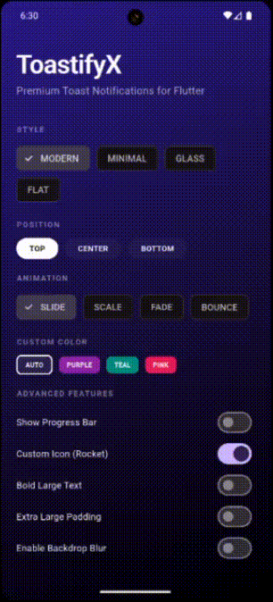
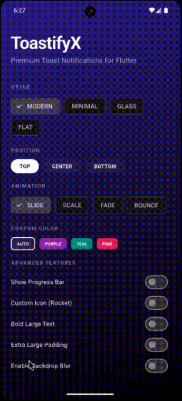
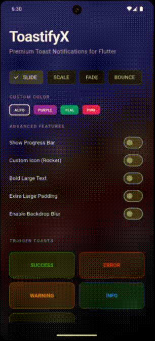

# ToastifyX 🚀

Premium, highly customizable toast notification system for Flutter. Elevate your app's UI with modern notification styles like **Modern**, **Minimal**, **Glass**, and **Flat**.


## ✨ Features

- 📍 **3 Layout Positions**: `top`, `bottom`, and `center`.
- 🍞 **5 Notification Types**: Success, Error, Warning, Info, and Loading.
- 🎨 **4 Premium Styles**: `modern`, `minimal`, `glass`, and `flat`.
- 🌫️ **Backdrop Blur**: Real-time glassmorphism effect.
- 🎬 **4 Animation Types**: `slide`, `scale`, `fade`, and `bounce`.
- ⏳ **Progress Indicators**: Support for built-in linear progress bars.
- 🛠️ **Fully Customizable**: Icons, TextStyles, Padding, and Margin.
- 🎯 **No Context Required**: Show toasts from anywhere using `toastNavigatorKey`.

## 🚀 Getting started

Add `toastify_x` to your `pubspec.yaml`:

```yaml
dependencies:
  toastify_x: ^1.0.0
```

## 🛠 Usage

First, add the `toastNavigatorKey` to your `MaterialApp` to enable toast support globally without having to pass context every time from deep in the widget tree.

```dart
import 'package:toastify_x/toastify_x.dart';

void main() {
  runApp(
    MaterialApp(
      navigatorKey: toastNavigatorKey, // REQUIRED
      home: YourHomeScreen(),
    ),
  );
}
```

Then, show a toast from anywhere:

```dart
ToastifyX.show(
  context,
  message: "Your message here!",
  type: ToastType.success,
  style: ToastStyle.glass,
  position: ToastPosition.top,
  enableBlur: true,
);
```

### 🎯 Pro Tip: Global Access (No context required!)
If you use the `toastNavigatorKey`, you can call `ToastifyX.show(null, ...)` and it will automatically use the root navigator's context.

## 📱 Demo UI

Check out the `example` directory for a fully interactive demo app to see all combinations in action!

### 🎨 Style Showcase


### 📍 Custom Positions & Types
| Positions | Types | Effects |
| :---: | :---: | :---: |
|  |  |  |

## 📜 License

This project is licensed under the MIT License - see the [LICENSE](LICENSE) file for details.
